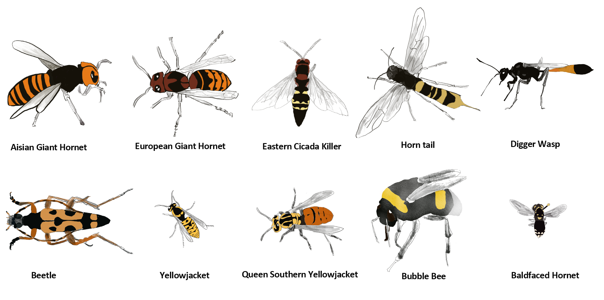
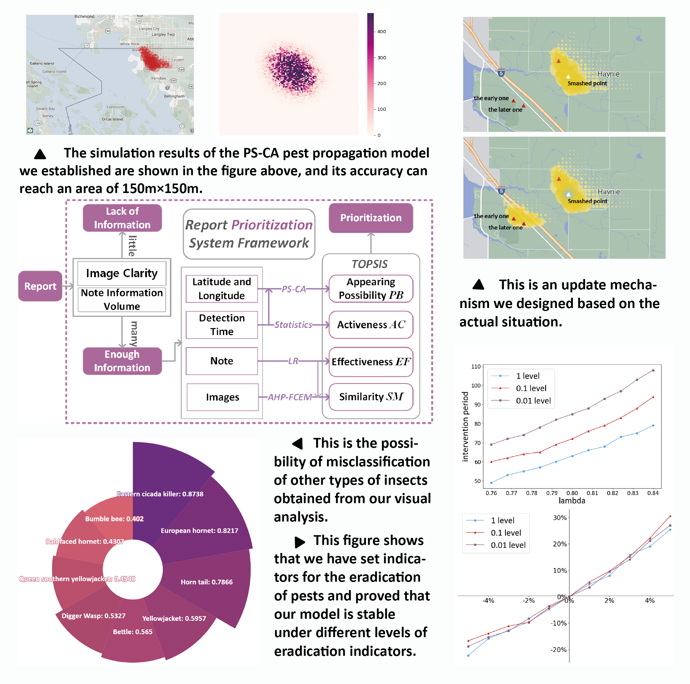

# MCM 2100585

I served as the team leader during a four-day competition period, coordinating a small research team to produce a 20-page paper on a real-world research problem: modeling the spread and eradication of the invasive pest. Our methodology combined a Cellular Automata model to simulate geographic spread, statistical methodologies to assess visual similarity and estimate misclassification risk, and Logistic Regression to screen report quality. Our work received a Finalist Award, placing in the top 1% worldwide.

> **Award Highlight:** Finalist Award, Top 1% Worldwide

## Bee Atlas Visualization

We visualized the complete bee atlas used in our analysis, organizing the visual reference set into a clear comparative guide for identifying and distinguishing species.

## Poster

The poster below summarizes the core modeling workflow, major findings, and communication strategy of our final solution.

